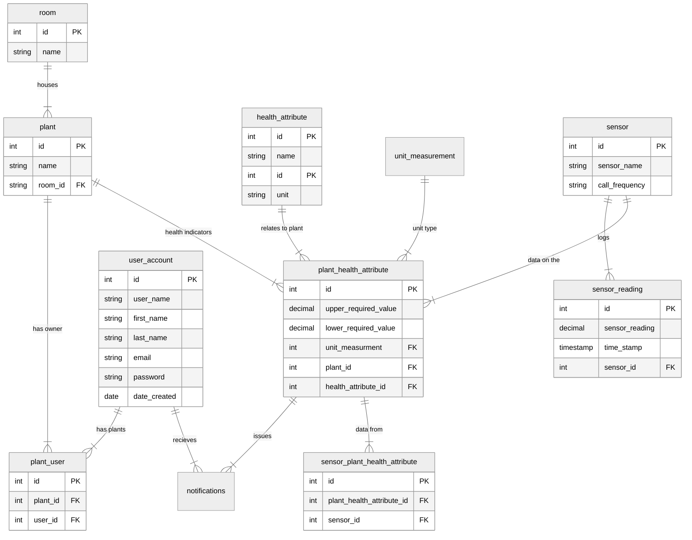

```mermaid
%%{init: {'theme':'neutral'}}%%
erDiagram

    room ||--|{ plant : "houses"
    
    room {
        int id PK
        string name
    }
    
    
    plant ||--|{ plant_user : "has owner"
    plant ||--|{ plant_health_attribute : "health indicators"
    
    plant {
        int id PK
        string name
        string room_id FK
    }
    
    user_account ||--|{ plant_user : "has plants"
    user_account ||--|{ notifications : "recieves"
    
    user_account {
        int id PK
        string user_name
        string first_name
        string last_name
        string email
        string password
        date date_created
    }
    
    plant_user {
        int id PK
        int plant_id FK
        int user_id FK
    }
    
    
    health_attribute ||--|{ plant_health_attribute: "relates to plant"
    
    health_attribute{
        int id PK
        string name
    }
    
    
    unit_measurement ||--|{ plant_health_attribute: "unit type"
    
    health_attribute{
        int id PK
        string unit
    }
    
    
    plant_health_attribute ||--|{ notifications: "issues"
    plant_health_attribute ||--|{ sensor_plant_health_attribute: "data from"
    
    plant_health_attribute{
        int id PK
        decimal upper_required_value
        decimal lower_required_value
        int unit_measurment FK
        int plant_id FK
        int health_attribute_id FK
    }
    
    sensor ||--|{ sensor_reading: "logs"
    sensor ||--|{ plant_health_attribute: "data on the"
    
    sensor{
        int id PK
        string sensor_name
        string call_frequency
    }
    
    sensor_reading{
        int id PK
        decimal sensor_reading
        timestamp time_stamp
        int sensor_id FK
    }
    
    sensor_plant_health_attribute{
        int id PK
        int plant_health_attribute_id FK
        int sensor_id FK
   }
```
